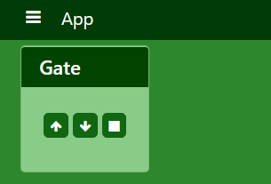
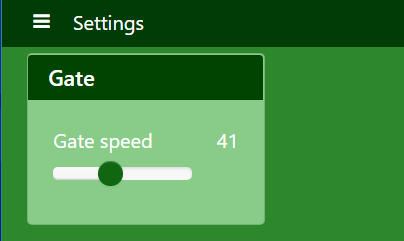

==============
Actions
==============

Actions are distributed functions that may be called from anywhere in your kervi application.
The framework handles process and network boundaries for you if your application
is a kervi multiprocess/multi device application and/or uses kervi modules. 

Define actions
--------------

You turn a function into an action via the @action decorator

.. code:: python

    from kervi.actions import action

    @action
    def my_action(p):
        print("my action", p)

You are now able to call it from anywhere in your application via:

.. code:: python

    from kervi.actions import Actions

    Actions["my_action"]("x")

The @action decorator takes the optional parameters action_id.

.. code:: python

    from kervi.actions import action

    @action(action_id="alternative_id")
    def my_action(p):
        print("my action", p)

You now call it via:

.. code:: python

    from kervi.actions import Actions

    Actions["alternative_id"]("x")

You may also decorate methods in kervi controllers:

.. code:: python

    from kervi.controllers.controller import controller
    from kervi.actions import action
    
    class GateController(Controller):
        def __init__(self, controller_id="gate_controller", name="Gate controller"):
            super().__init__(controller_id, name)

        @action()
        def open(self, speed):
            print("open gate with speed:", speed)

And call the action

.. code:: python

    from kervi.actions import Actions

    Actions["gate_controller.open"](100)

Actions with timeout
--------------------

By default an action is called synchronius and first returns with the result when the action is completed.
If you expect your action to operate within a special time interval you can add the keyword parameter timeout to
the action call. If the execution time exceeds the timeout a TimeoutError exception is raised.

.. code:: python

    @action
    def my_action():
        print("started")
        time.sleep(10)
        print("done")

    try:
        my_action(timeout=5)
    except TimeoutError:
        print("Timout occured")

If the action is defined in another process or module call this way:

.. code:: python

    try:
        Actions["my_action"](timeout=5)
    except TimeoutError:
        print("time out in action")

Asynchronous action call
------------------------

It is possible to call an action asynchronously if your don't want to wait for the action to finish execution.
Just set the keyword argument run_async to true.

.. code:: python

    Actions["my_action"](run_async=True)

Interupts
---------

Sometimes you need to signal a running action during execution. 
To handle this situation you need to specify an interupt function for an action.

.. code:: python

    terminate = False
    @action
    def my_action():
        print("my_action start")
        
        while not terminate:
            time.sleep(.1)

        print("my_action done")

    @my_action.set_interupt
    def my_action_interupt():
        global terminate
        terminate = True
        print("interupt my_action")

    
    #call action
    Actions["my_action"]()

    #wait for five seconds
    time.sleep(5)

    #signal that the action should terminate
    Actions["my_action"].interupt() 

Interupts support parameters

.. code:: python

    @my_action.set_interupt
    def my_action_interupt(p1):
        global terminate
        terminate = True
        print("interupt my_action:", p1)

    Actions["my_action"].interupt("P 1")

Linking to dashboards
---------------------

It is possible to link actions to ui dashboards the same way as dynamic values.
A linked action will show up as a button on the panel.

.. code:: python

    @action
    def my_action():
        print("this is my action")

    my_action.link_to_dashboard("app", "gate")
    
You can send parameters to the action.

.. code:: python 

    from kervi.actions import action

    @action(name="My action")
    def my_action(p):
        print("my_action is called with:", p)

    my_action.link_to_dashboard("app", "gate", action_parameters=["x"])

If an interupt function is set for the action it will be called when the button is released. 

.. code:: python 

    from kervi.actions import action

    @action(name="My action")
    def my_action(p):
        print("my_action is called with:", p)

    @my_action.set_interupt
    def my_action_interupt():
        print("my_action interupt called")

    my_action.link_to_dashboard("app", "gate", action_parameters=["x"])

You are able to specify parameters that should be send in the interupt.

.. code:: python 

    from kervi.actions import action

    @action(name="My action")
    def my_action(p):
        print("my_action is called with:", p)

    @my_action.set_interupt
    def my_action_interupt(p):
        print("my_action interupt called: ", p)

    my_action.link_to_dashboard("app", "gate", action_parameters=["x"], interupt_parameters=["i"])

Other keyword parameters you can use in link_to_dashboard:

    * *link_to_header* (``str``) -- Link this action to the header of the panel.

    * *label_icon* (``str``) -- Icon that should be displayed together with label.

    * *label* (``str``) -- Label text, default value is the name of the action.

    * *flat* (``bool``) -- Flat look and feel.

    * *inline* (``bool``) -- 
        Display button and label in its actual size
        If you set inline to true the size parameter is ignored.
        The action will only occupy as much space as the label and input takes.

    
    * *on_text* (``string``) -- Text to display when switch is on.
    * *off_text* (``string``) -- Text to display when switch is off.
    * *on_icon* (``string``) -- Icon to display when switch is on.
    * *off_icon* (``string``) -- Icon to display when switch is off.

    * *button_icon* (``string``) -- Icon to display on button.
    * *button_text* (``string``) -- Text to display on button, default is name.

    * *action_parameters* (``list``) -- list of parameters to pass to the action.

    * *interupt_enabled* (``bool``) -- If true the button will send interupt to action on off. Default true if an interupt is specified for the action.
    * *interupt_parameters* (``list``) -- List of parameters to pass to the interupt function of the action.

System actions
--------------

When the kervi application has loaded and started all processes it calls the app_main action this is your hook where you can
start your application logic. In the way app_exit action is called upon termination of the kervi application.

It is optional for you to define these actions in your application.

.. code:: python

    @action
    def app_main():
        #start your application logic here

    @action
    def app_exit():
        #application logic that cleans up

You can control the application via the following actions

.. code:: python

    #stop the application
    Actions["app.stop"]

    #restart the application
    Actions["app.restart"]

    #shut down application device (Raspberry pi)
    Actions["app.shutdown"]

    #reboot application device (Raspberry pi)
    Actions["app.reboot"]

Complete example
-----------------

This is a complete example that shows a gate controller that controls a motor and have two end stop switches.

There are to two actions move_gate and stop_gate these are linked to the "gate" panel on the app dashboard.

.. code:: python

    if __name__ == '__main__':
        import time
        from kervi.application import Application

        APP = Application()
        
        from kervi.dashboards import Dashboard, DashboardPanel
        Dashboard(
            "app",
            "App",
            [
                DashboardPanel("gate", title="Gate")
            ],
            is_default=True
        )

        Dashboard(
            "settings",
            "Settings",
            [
                DashboardPanel("gate", width="200px", title="Gate")
            ]
        )

        from kervi.controllers.controller import Controller
        from kervi.actions import action
        from kervi.values import DynamicNumber, DynamicBoolean
        
        class GateController(Controller):
            def __init__(self, controller_id="gate_controller", name="Gate controller"):
                super().__init__(controller_id, name)

                self.gate_speed = self.inputs.add("speed", "Gate speed", DynamicNumber)
                self.gate_speed.value = 100
                self.gate_speed.min = 0
                self.gate_speed.persist_value = True

                self.lo_end_stop = self.inputs.add("lo_end_stop", "low end stop", DynamicBoolean)
                self.hi_end_stop = self.inputs.add("hi_end_stop", "High end stop", DynamicBoolean)

                self.gate_motor_speed = self.outputs.add("gate_motor_speed", "Gate motor speed", DynamicNumber)

                self._stop_move = False

            @action(name="Move gate")
            def move_gate(self, open=True):
                if open:
                    print("open gate")
                    if not self.hi_end_stop.value:
                        self._stop_move = False
                        self.gate_motor_speed.value = self.gate_speed.value
                        while not self._stop_move and not self.hi_end_stop.value:
                            time.sleep(0.1)
                        self.gate_motor_speed.value = 0
                    if self.hi_end_stop.value:
                        print("Gate open")
                    else:
                        print("Gate stopped")
                else:
                    print("close gate:")
                    if not self.lo_end_stop.value:
                        self._stop_move = False
                        self.gate_motor_speed.value = -1 * self.gate_speed.value
                        while not self._stop_move and not self.lo_end_stop.value:
                            time.sleep(0.1)
                        self.gate_motor_speed.value = 0
                    if self.lo_end_stop.value:
                        print("Gate closed")
                    else:
                        print("Gate stopped")

            @move_gate.set_interupt
            def move_gate_interrupt(self):
                print("stop gate:")
                self._stop_move = True

            def on_start(self):
                print("gate controller is started")
                self.gate_motor_speed.value = 0

            def input_changed(self, changed_input):
                pass

        gate_controller = GateController()
        gate_controller.move_gate.link_to_dashboard("app", "gate", inline=True, button_text=None, button_icon="arrow-up", label=None, action_parameters=[True], )
        gate_controller.move_gate.link_to_dashboard("app", "gate", inline=True, button_text=None, button_icon="arrow-down", label=None, action_parameters=[False])
        
        gate_controller.link_to_dashboard("settings", "gate")

        from kervi.devices.motors.dummy_motor_driver import DummyMotorBoard

        motor_board = DummyMotorBoard()
        gate_controller.gate_motor_speed.link_to(motor_board.dc_motors[0].speed)

        from kervi.hal import GPIO
        GPIO["GPIO2"].define_as_input()
        GPIO["GPIO3"].define_as_input()

        gate_controller.lo_end_stop.link_to(GPIO["GPIO2"])
        gate_controller.hi_end_stop.link_to(GPIO["GPIO3"])

        APP.run()

The result is an app with two dashboards "app" where the gate is controlled and "settings" where the speed 
of the gate speed could be set.  

Multiprocess
------------

This example shows how to set up at simple robot and control it via an external script of commands.

It consists of two scripts robot.py that should be executed on the robot
and a script robot_task.py that holds a series of actions that the robot should perform.

robot.py is a kervi application that you should execute on your Raspberry pi, when started it will show the ip address of the app this should be used in the robot_task.py script.

.. code:: python
    
    if __name__ == '__main__':
        from kervi.application import Application

        APP = Application()

        from kervi.controllers.steering import MotorSteering
        from kervi.devices.motors.dummy_motor_driver import DummyMotorBoard

        motor_board = DummyMotorBoard()
        steering = MotorSteering()
        
        steering.left_speed.link_to(motor_board.dc_motors[0])
        steering.right_speed.link_to(motor_board.dc_motors[1])

        @action
        def app_main():
            steering.stop()

The other python script robot_tasks.py is a kervi module that connects to the
kervi application in robot.py. You can run it on the robot itself or another computer
on your local network.

.. code:: python

    if __name__ == '__main__':
        from kervi.module import Module
        from kervi.actions import action, Actions
        module = Module({
            "network" : {
                "ipc_root_address": "#Enter the ip that is displayed when running robot.py#"
            }
        })
        
        @action
        def module_main():
            #move for 5 seconds at 100% speed
            Actions["steering.move"](100, duration=5)
            #turn right at 50% speed
            Actions["steering.rotate"](50, degree=90)

        module.run()