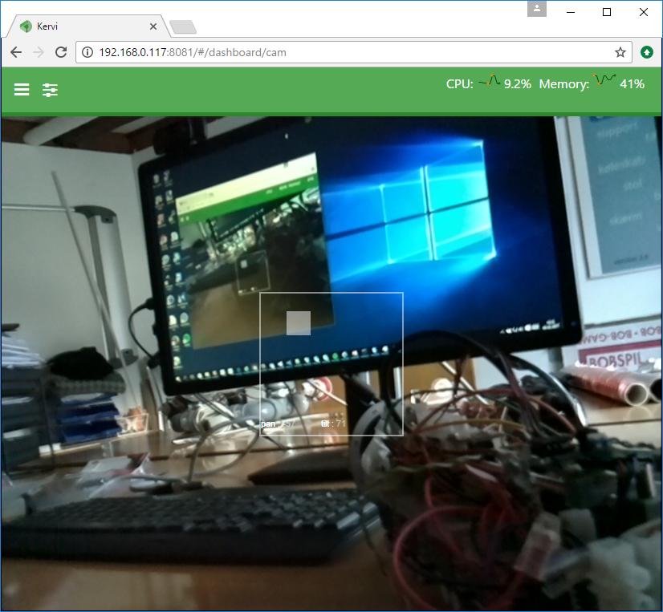
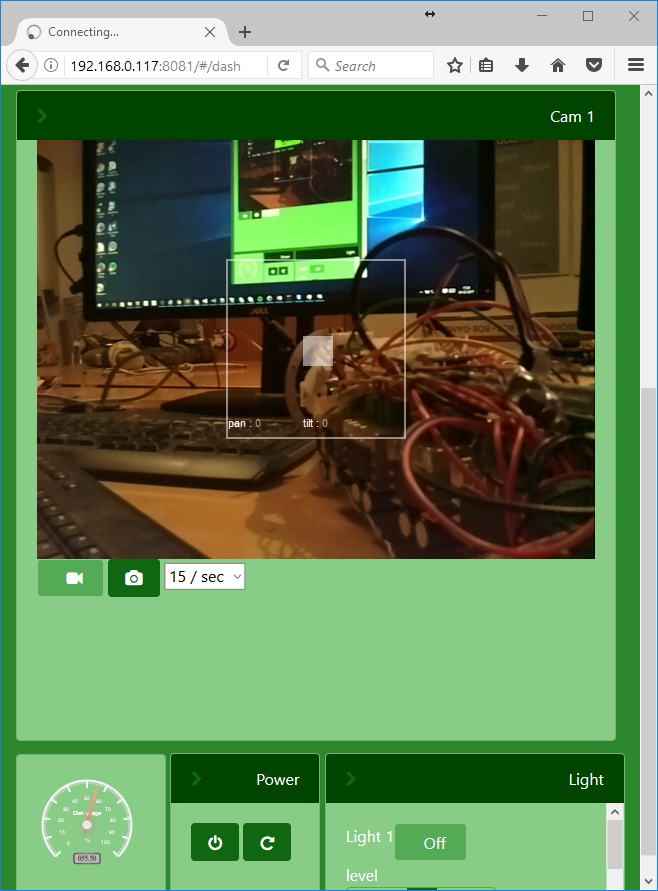

Camera and video
=================================

Cameras are managed via special Kervi Camera controllers and Kervi camera device drivers.
A camera device driver capture frames from a camera and feeds them into the camera controller.

The snippet below shows how to create a camera stream server and link it to a dashboard.
 

.. code:: python
    
    import datetime
    from kervi.camera import CameraStreamer
    from kervi_devices.motors.PCA9685_i2c_servo import PCA9685ServoBoard

    #Create a streaming camera server
    CAM1 = CameraStreamer("cam1", "camera 1")
    CAM1.flip_vertical = True
    CAM1.flip_horizontal = True
    
    #link camera as background
    CAM1.link_to_dashboard("app")
    #link camera to a panel
    CAM1.link_to_dashboard("system", "cam")

**Size**

It is possible to pass values for size and frames per second when you create the camera.

.. code:: python
    
    from kervi.camera import CameraStreamer
    CAMERA = CameraStreamer("cam1", "camera 1", size=1024, width=800, fps=30)

**Source**

In the examples above the camera source is not specified and Kervi looks for the default camera. On a Raspberry Pi it will be
the on board camera. If you want to use another camera source than the default you need to specify it. 

.. code:: python
    
    from kervi.camera import CameraStreamer
    CAMERA = CameraStreamer("cam1", "camera 1", camera_source="/dev/video0")

**Pan and tilt**

The cam viewer in the dashboards have a pan/tilt area at the center of the image.
If you have rigged up the camera with pan and tilt servos you can connect the servos with the pan/tilt area
by using the following code.

.. code:: python

    import datetime
    from kervi.camera import CameraStreamer
    from kervi_devices.motors.PCA9685_i2c_servo import PCA9685ServoBoard

    #Create a streaming camera server
    CAM1 = CameraStreamer("cam1", "camera 1")
    CAM1.flip_vertical = True
    CAM1.flip_horizontal = True
    
    #link camera as background
    CAM1.link_to_dashboard("app")
    #link camera to a panel
    CAM1.link_to_dashboard("system", "cam")

    #link pan and tilt to servos
    motor_board = PCA9685ServoBoard()
    motor_board.servo_motors[0].position.link_to(CAM1.pan)
    motor_board.servo_motors[1].position.link_to(CAM1.tilt)

.. toctree::
   :hidden:

   camera_api