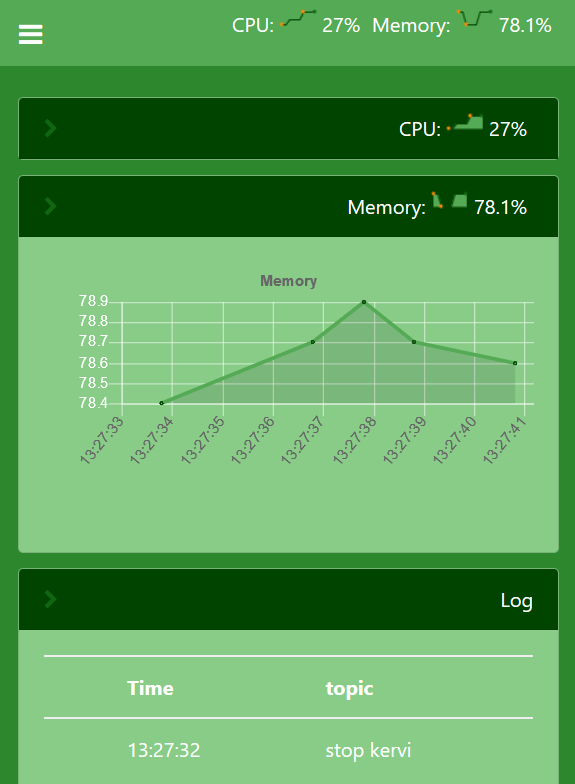
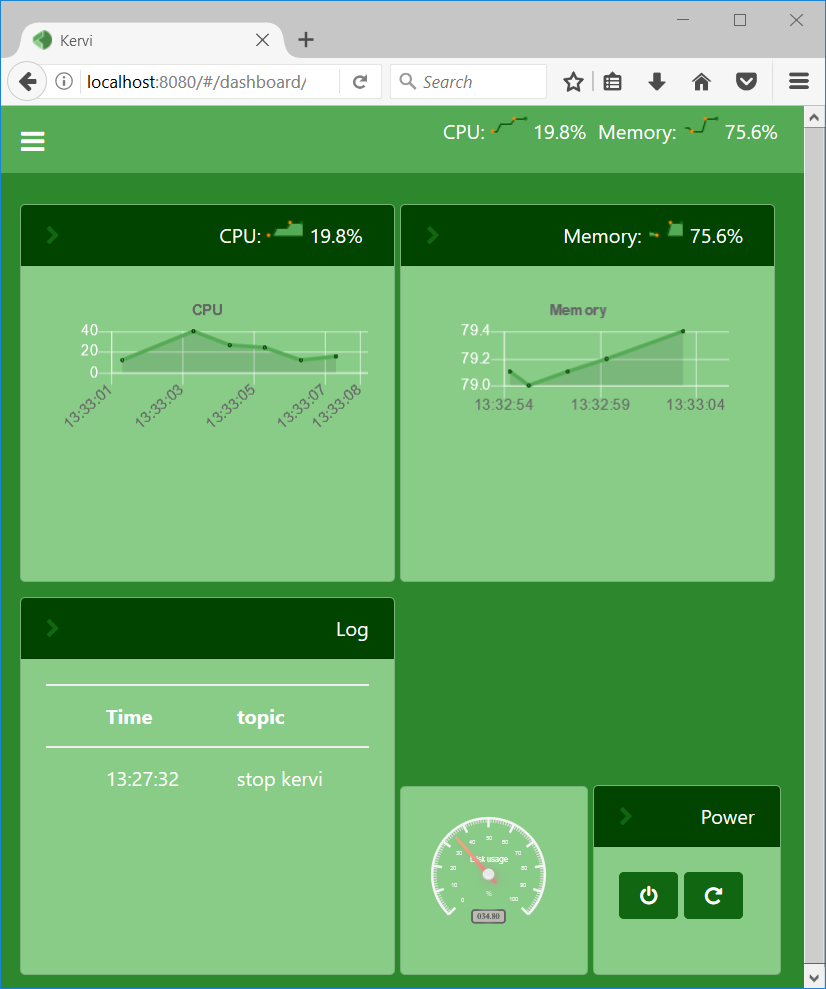
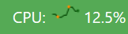
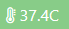
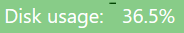
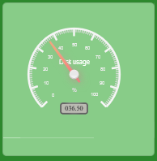
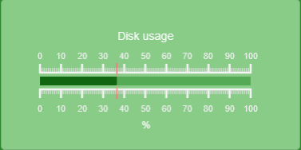
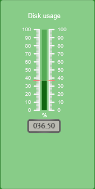
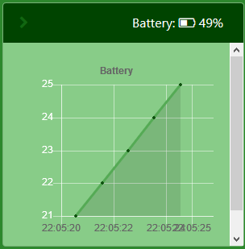

==========
Dashboards
==========

An application may define one or more dashboards. If it is a home automation application
A dashboard could be a room or a floor.

Each dashboard contains one or more panels where it is possible to link sensors, controllers, camera and other components.

The dashboards are responsive and adjust to the width of the browser. Below is the same dashboard in mobile and browser view. 

.. image:: 

The code below shows how to configure the dashboard above

.. code-block:: python

    SYSTEM = Dashboard("system", "System")
    SYSTEM.add_panel(DashboardPanel("cpu", columns=2, rows=2, collapsed=True))
    SYSTEM.add_panel(DashboardPanel("memory", columns=2, rows=2, collapsed=True))
    SYSTEM.add_panel(DashboardPanel("log", columns=2, rows=2, title="Log", user_log=True))
    SYSTEM.add_panel(DashboardPanel("disk", columns=1, rows=1))
    SYSTEM.add_panel(DashboardPanel("power", columns=1, rows=1, title="Power"))

On large displays the columns and rows specify the size of a panel where the cell size is 150x150 pixels.

If a title is set for a panel it will be displayed in a header.

Collapsed specify if the panel should be collapsed when a panel is first shown.

If user_log is set to true the panel will show the content of the user log for the application.

Linking
=======

A kervi component is linked to a panel by calling the link_to_dashboard method on the component.
This method takes several parameters that specify how the component should be displayed.

When a component is linked to a panel it is specified how many cells that component should occupy in that panel via the size parameter.

.. code-block:: python
    
    #sensor that links as a radial guage 
    cpu_temp.link_to_dashboard("cam", "panel1", type="radial_gauge")

    #A sensor that links to the header of a panel and into the body. 
    cpu_temp.link_to_dashboard("system", "cpu", type="value", size=2, link_to_header=True)
    cpu_temp.link_to_dashboard("system", "cpu", type="chart", size=2)

    #A button that links to a panel with an icon.
    GPIO[12].link_to_dashboard("system", "power", icon="power-off")

Sensors and dynamic numbers
***************************

Linked output components like sensors, controller outputs and analog GPIO input channels can displayed in different ways: just value, value with sparkline, as an animated icon, chart or different kind of gauges.

**Value and sparkline**

If a sensor is linked with just dashboard and panel as parameters it will be displayed with name, sparkline and value.

.. code-block:: python
    
    SENSOR_1.link_to_dashboard("system", "section1")

**Value and icon**

It is possible to show an icon next to a value. Kervi uses Font awesome icons. Just enter the name of the icon without *fa-*

.. code-block:: python
    
    SENSOR_1.link_to_dashboard("system", "temp", icon="thermometer-full", show_sparkline=False, show_name=False)

**Value and no sparkline**

.. code-block:: python
    
    SENSOR_1.link_to_dashboard("system", "section1", show_sparkline=False)

**radial gauge**

.. code-block:: python
    
    SENSOR_1.link_to_dashboard("system", "section1", type="radial_gauge")

**Horizontal gauge**

.. code-block:: python
    
    SENSOR_1.link_to_dashboard("system", "section1", type="horizontal_linear_gauge")

**Vertical gauge**

.. code-block:: python
    
    SENSOR_1.link_to_dashboard("system", "section1", type="vertical_linear_gauge")

**Animated icon**

Below is a full example of a battery sensor where the icon change depending on value.
The sensor is linked twice first to the header with the animation and into the body as a chart. 

.. code-block:: python
    
    from kervi.sensor import Sensor
    

    SENSOR_1.set_ui_parameter("icon", [
        {
            "range":[0, 5],
            "icon":"battery-empty"
        },
        {
            "range":[5, 25],
            "icon":"battery-quarter"
        },
        {
            "range":[20, 50],
            "icon":"battery-half"
        },
        {
            "range":[5, 75],
            "icon":"battery-three-quarter"
        },
        {
            "range":[75, 100],
            "icon":"battery-full"
        }
    ])

    #link the sensor to the header
    SENSOR_1.link_to_dashboard(
        "system", "battery",
        show_sparkline=False,
        show_value=False,
        link_to_header=True
    )

    #link the sensor as a chart
    SENSOR_1.link_to_dashboard("system", "battery", type="chart")

    

GPIO and dynamic boolean
************************

Linked output components like digital GPIO channels and boolean controller input/outputs
are displayed as a switch button or push button.
If the dynamic value is an GPIO input channel or a controller output the button is read only.

If the dynamic value is a output GPIO channel or a controller input the user will be able to switch/push the button. 

Controller pads
===============

Each dashboard has two controller pads each with an x and y axis. 
It is possible to link DynamicNumber values to these axes
by using the panel names left_pad_x, left_pad_y, right_pad_x, right_pad_y.

.. code-block:: python

    motor_controller.dc_motors[0].speed.link_to_dashboard("main", "left_pad_x")

.. rubric:: 

.. toctree::
   :hidden:

   dashboards_api