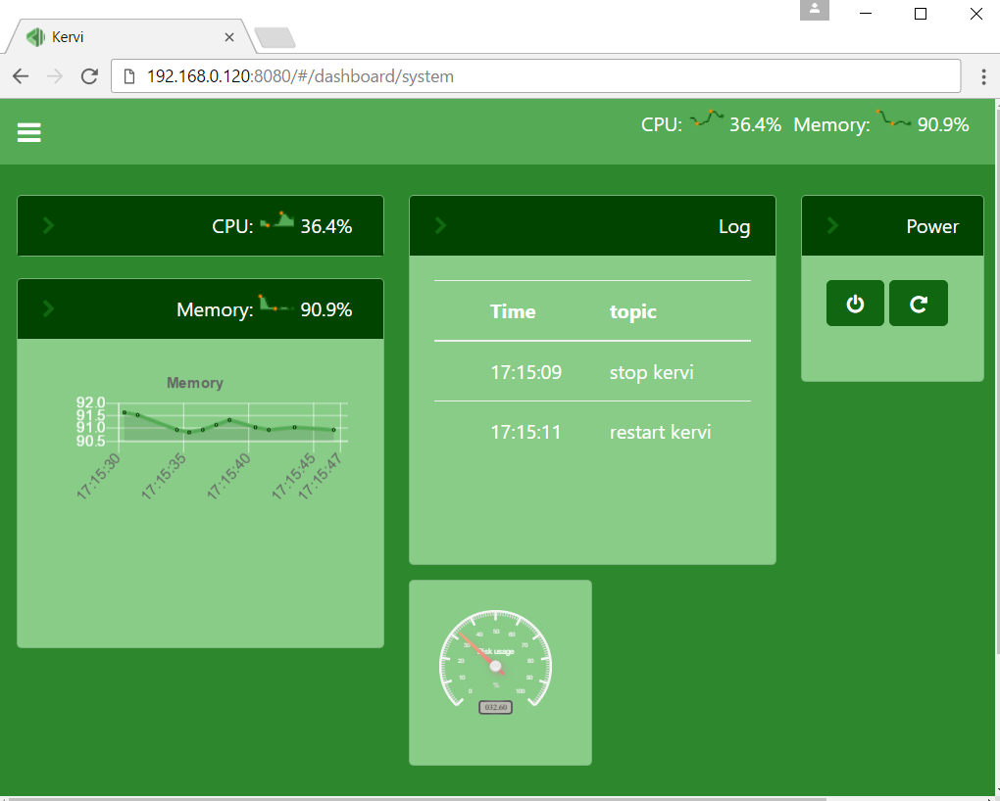

=================================
Get started
=================================

prerequisites
=============

Kervi is a python framework and needs python 3.4+ and the python package manager pip. 

The standard Raspberry Pi operating systems comes with python and pip preinstalled. 
If you are able to start your Raspberry Pi you are ready to install Kervi.

If you install on other platforms like windows and linux you have to install python and pip. Please follow the instructions on python.org to get python installed. 
Notice there are no native support for hardware when your install on these platforms but you will be able to
create dashboards and let users interact with your python kervi application via a browser.

Install
========

Open a terminal window and run the pip command below. 

Raspberry Pi::

    sudo pip3 install kervi[rpi]

Other platforms::

    pip3 install kervi

Create application
==================

Next your create a folder for your application::

    mkdir myapp
    cd myapp

After kervi is installed a commandline tool *kervi* is available that helps creates skeleton code for your Kervi apps.
You have two choices when it comes to creation of kervi applications via the commandline tool.

Single file application
-----------------------

If you are new to Kervi or just wants to make a quick test application then a single file kervi application is a good chooice to get going.
You create the single file app via the following command in the terminal window::

    kervi create application myapp "My first app" --single_file_app

Multi process/file application
------------------------------

If you are planning to build a robot or home automation system it is recommended to create a normal Kervi application. 
Such an application consists of several files and the Kervi framework is able to spread the load on all the cores on your board. 

To create a full kervi application write the following command in the terminal::
    
    kervi create application myapp "My first app"

Start application
-----------------

You start your new app by executing:: 

    python3 myapp.py

The following output should be displayed (example)::

    Starting kervi application, please wait
    load sensors
    load controllers
    load cameras
    init IPC
    Your Kervi application is ready at http://192.168.0.120:8080

If you enter the url into at browser you should see something like this

